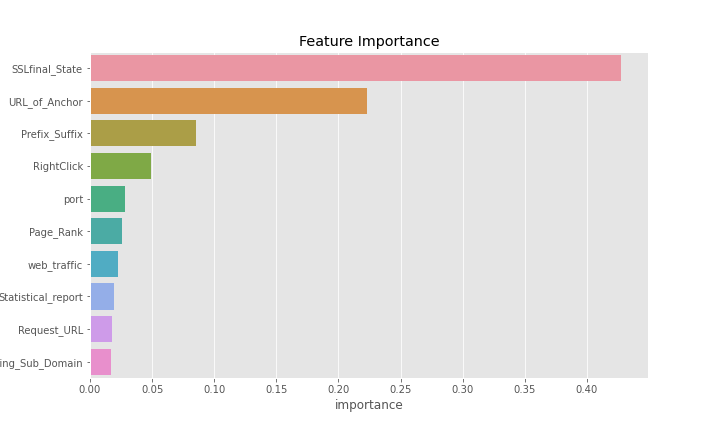

# Phishing Websites Classification

## Objective
A phishing website is a common social engineering method that mimics trustful uniform resource locators (URLs) and webpages. The objective of this project is to train machine learning models that can identify phishing websites based on its URL and other features.

## Dataset
This fishing website dataset is provided by evenltics for their ML Test. It can be on downloaded from [here](https://drive.google.com/open?id=1INjk9MQ-CiPlFzp2UA2Gr8yX2F_kR2xy8UQhWWcyQsI).

## Model & Training
Before stating the ML model training, the data is split into 80-20 i.e., 1965 training samples & 491 testing samples. From the dataset, it is clear that this is a supervised machine learning task. There are two major types of supervised machine learning problems, called classification and regression.

This is a classification problem, as the input URL is classified as phishing or legitimate based on its features. The supervised machine learning models (classification) considered to train the dataset in this project are:
- Logistic Regression
- XGBoost

Firstly I've trained a `logistic regression` model as base model which gave accuracy of 94%. As the dataset is small and feature like `SSLfinal_State` and `URL_of_Anchor` have very high correrelation with target variable, even basic model like logistic model is givivng high accucary. But it can be improved.

Second model I've trained was a `XGBoost` model which gave accuracy of 98%. This is a significant improvement from the base model. 

But as hinted by correlation matrix, there are still some useless features present in the dataset. I have tried to remove these features using `Mutual Information` and retrain XGB model with remaining features which still gave accuracy of 98%.

    <em> 
 <b> Confuion Matrix of Final XGB Model <b>
</em>
    

        
        

    <em> 
 <b> Most Important Feature for Classification <b>
</em>
    

